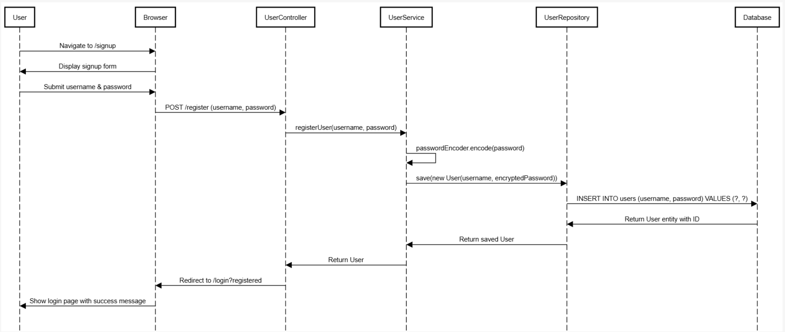
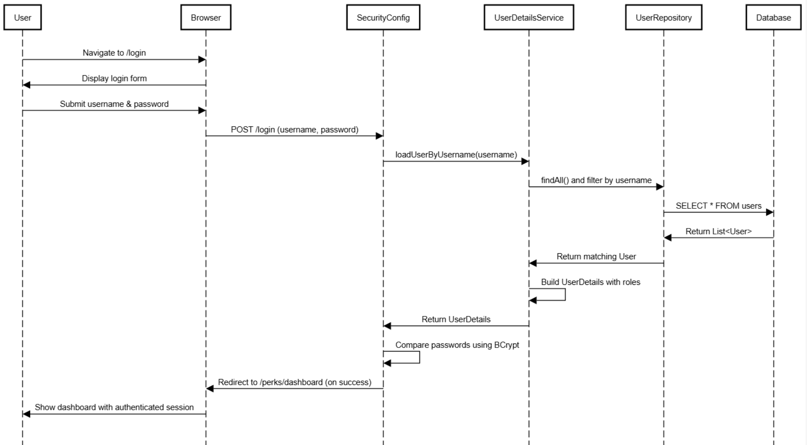
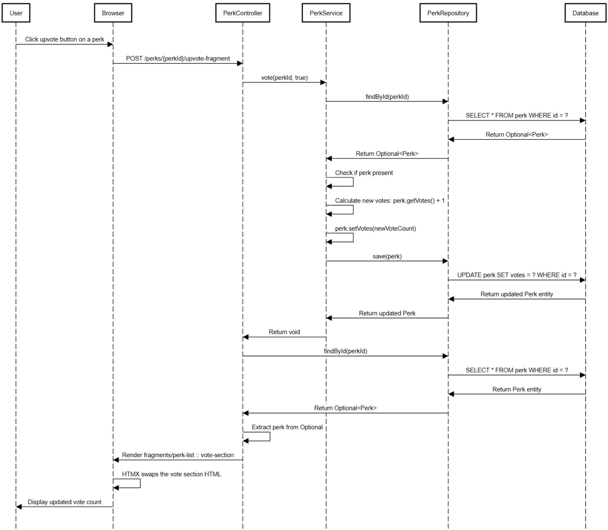

# Perk Manager

A web application for discovering, sharing, and managing membership perks across various reward programs. Users can browse perks from different membership programs (credit cards, loyalty programs, etc.), contribute their own discoveries, and vote on the most valuable benefits.


## Contributors
- Abduallah Aldabibi
- Adam Beehler
- Omar Hamzat
- Jad Hamzeh
- Akshun Kalra

## Tech Stack
- **Backend**: Spring Boot, Spring MVC, Spring Data JPA, Spring Security
- **Frontend**: Thymeleaf, HTML, CSS, HTMX
- **Build**: Apache Maven
- **Database**: JPA/Hibernate ORM
- **Security**: BCrypt password encryption
- **Deployment**: Docker, CI/CD with GitHub Actions

## Current Project Status

### Completed Features
- **User Authentication**: Secure user registration and login with encrypted passwords
- **Perk Discovery Dashboard**: Browse all available perks from various membership programs
- **Search & Filter**: Search perks by membership type (Aeroplan, Scene+, PC Optimum, etc.)
- **Sorting Options**: Sort perks by vote count or expiry date
- **Perk Creation**: Authenticated users can submit new perks with details including:
  - Title and description
  - Region/availability
  - Membership program association
  - Expiry date
- **Voting System**: Community-driven upvote/downvote functionality to highlight valuable perks
- **REST API**: Full RESTful API endpoints for programmatic access
- **Pre-loaded Data**: Sample membership types and demo perks for quick testing

### Available Membership Programs
The system comes pre-loaded with popular Canadian membership programs:
- Air Miles
- PC Optimum
- CAA
- Visa, Mastercard, American Express
- Scene+
- Aeroplan
- Costco
- Amazon Prime

## How to Run the Application

### Prerequisites
- Git
- Java JDK 17 (or newer)
- Apache Maven
- Docker (optional, for containerized deployment)

### Option 1: Run Locally with Maven

1. **Clone the repository:**
   ```bash
   git clone https://github.com/JadHamzeh/SYSC4806A-project-Group-38.git
   cd perk-manager
   ```

2. **Build and Test:**
   ```bash
   ./mvnw clean install
   ```

3. **Run the application:**
   ```bash
   ./mvnw spring-boot:run
   ```
   
   Or run the JAR directly:
   ```bash
   java -jar target/perk-manager-0.0.1-SNAPSHOT.jar
   ```

4. **Access the application:**
   - Navigate to `http://localhost:8081`
   - Demo account: username `demo`, password `demo123`


## API Endpoints

### Perks API (`/api/perks`)
- `GET /api/perks` - Get all perks
- `GET /api/perks/search?membershipType={type}` - Search perks by membership
- `POST /api/perks` - Create a new perk
- `POST /api/perks/{perkId}/vote?upvote={true|false}` - Vote on a perk
- `DELETE /api/perks/{perkId}` - Delete a perk

### Users API (`/api/users`)
- `POST /api/users/register` - Register a new user
- `GET /api/users/{userId}` - Get user details
- `POST /api/users/{userId}/memberships` - Add membership to user

## Project Structure

```
src/main/java/perk/manager/
├── ServingWebContentApplication.java  # Main Spring Boot application
├── Models/
│   ├── User.java                      # User entity
│   ├── Perk.java                      # Perk entity
│   ├── MembershipType.java            # Membership program entity
│   └── UserMembership.java            # User-membership relationship
├── Controllers/
│   ├── UserController.java            # Web UI for users
│   ├── PerkController.java            # Web UI for perks
│   ├── UserRestController.java        # REST API for users
│   └── PerkRestController.java        # REST API for perks
├── Services/
│   ├── UserService.java               # User business logic
│   ├── PerkService.java               # Perk business logic
│   ├── MembershipService.java         # Membership business logic
│   └── UserMembershipService.java     # User-membership logic
├── Repositories.java                  # JPA repositories
├── SecurityConfig.java                # Spring Security configuration
└── DataLoader.java                    # Sample data initialization
```

## Development Workflow

### Git Flow
- All changes require Pull Requests
- Minimum 1 reviewers per PR before merging to `main`

### Testing
Run all tests with:
```bash
./mvnw test
```

### Code Reviews
- All PRs must pass CI checks
- Code must be reviewed by at least one team members
- Follow existing code style and patterns


**Live Application URL**: https://sysc4806group38assignment-hvesg2fhasdtb5aj.canadacentral-01.azurewebsites.net/

## Azure Server Build

[](https://github.com/JadHamzeh/SYSC4806A-project-Group-38/actions/workflows/master_sysc4806group38assignment.yml)

## Database Schema

The application uses JPA/Hibernate to automatically generate the database schema from entity classes:

### Core Entities
- **Users**: User accounts with encrypted passwords
- **Perks**: Benefit listings with title, description, region, votes, expiry
- **MembershipType**: Available membership programs
- **UserMembership**: Many-to-many relationship between users and memberships

### Key Relationships
- User → Perks (one-to-many: users can create multiple perks)
- User → UserMembership → MembershipType (many-to-many: users can have multiple memberships)
- Perk → MembershipType (many-to-one: each perk belongs to one program)
- Perk → User (many-to-one: each perk has one creator)

## Security Features
- Password encryption using BCrypt
- Spring Security integration for authentication/authorization
- CSRF protection disabled for API endpoints (enable in production)
- Session-based authentication
- Protected routes requiring authentication


# Sequence Diagrams

## 1. User Registration Flow


## 2. User Login Flow


## 3. Perk Creation Flow


## 4. Search & Filter Perks Flow


## 5. Upvote/Downvote Flow


# UMLs

## 1. User


## 2. Perk


## 3. Data Loader


## 4. User Controller


## 5. Perk Controller

